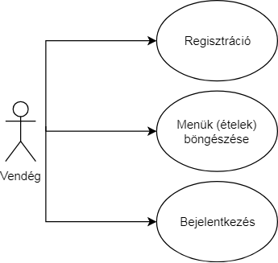
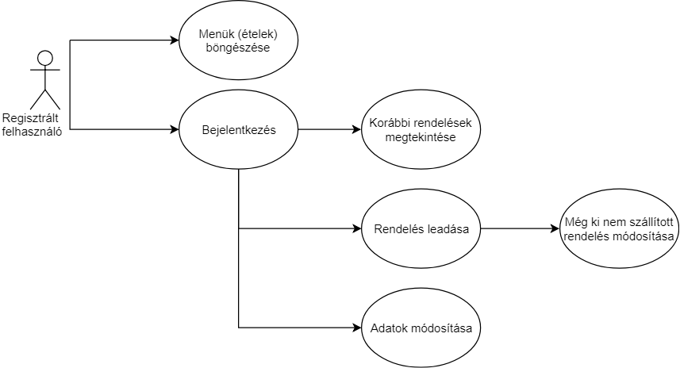
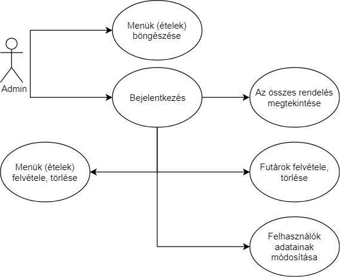
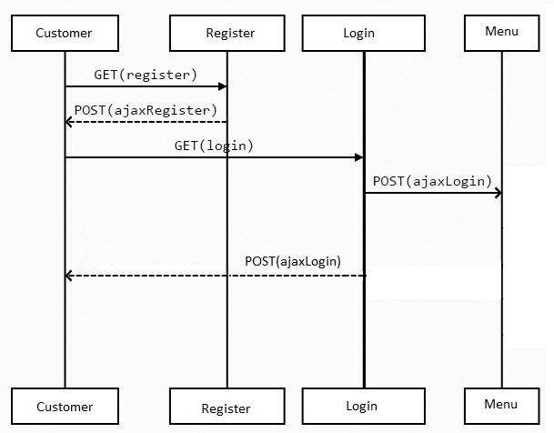
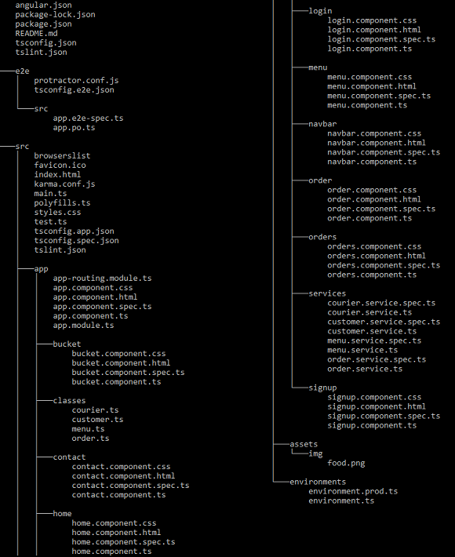

Alkalmazás fejlesztés beadandó
============

---
## KÖVETELMÉNYANALÍZIS

### Étterem
A program egy étterem ételrendeléseit reprezentálja. 
Az étterem rendelkezik egy menüsorral, mely bárki számára megtekinthető.
A vendégek rendeléseket leadni csak bejelentkezve tudnak, melyhez regisztráció szükséges. 
A megrendelt ételek kiszállítását a futárok végzik.

#### Funkcionális követelmények
* Regisztráció
* Bejelentkezés
* Étlap megtekintése
* Az étterem elérhetőségeinek megtekintése
* Bejelentkezett felhasználóknak
 	* Étel kosárba helyezése
 	* Étel törlése a kosárból
 	* Rendelés leadása
 	* Korábbi rendelések megtekintése
 	* Adatok módosítása

#### Nem funkcionális követelmények
* Felhasználóbarát: Megfelelően elhatárolt funkciók. Világos, látható színekkel írt szövegek. Ésszerű elrendezés.
* Biztonság: Jelszóval védett funkciók. Titkosított jelszavak.
* Gyors és megbízható működés: Adatbázis használata
 
### Szakterületi fogalomjegyzék
Az alkalmazás megértéséhez nem szükségesek szakszavak vagy nem mindennapi kifejezések

### Használatieset-modell

#### Szerepkörök
* Vendég: Az oldal nem regisztrált látogatója. Megtekintheti az étlapot, valamint az étterem elérhetőségeit. Tud a menüben keresni és regisztrálni.
* Bejelentkezett vendég: Regisztrált és bejelentkezett felhasználó, aki már rendeléseket is adhat le.

#### Felhasználói használati esetek
Vendég felhasználó esetén:

Regisztrált felhasználó esetén:

Az admin felhasználó:

## TERVEZÉS

### Architektúra terv

#### REST végpontok
* POST /api/register - Regisztrációs végpont az új felhasználók részére
* POST /api/login - Bejelentkező felület regisztrált felhasználók számára
* GET/POST /api/menus - Itt lehet listázni a menüket/hozzáadni újat
* GET/PATCH/DELETE /api/menus/{id} - Egy adott menü lekérdezése, módosítása, törlése
* GET/POST /api/orders - Itt lehet lekérdezni/leadni a rendeléseket (csak bejelentkezett felhasználóknak)
* GET/PATCH/DELETE /api/orders/{id} - Egy adott rendelés lekérdezése, módosítása, törlése
* GET /api/couriers - A futárok adatait itt lehet lekérdezni
* GET/PATCH/DELETE /api/couriers/{id} - Egy adott futár adatainak lekérdezése, módosítása, törlése
* GET /api/customers - A vásárlók adatainak lekérdezése
* GET/PATCH/DELETE /api/customers/{id} - Egy adott várásló adatainak lekérdezése

### Felhasználóifelület-modell

#### Képernyőterv

### Osztálymodell

#### Táblák
* Rendelések
* Ételek
* Vendégek
* Futárok

#### Kapcsolatok
* Rendelések-Ételek: sok-sok kapcsolat
* Vendégek-Rendelések: egy-sok kapcsolat
* Futárok-Rendelések: egy-sok kapcsolat

#### Tábal kapcsolat diagram (egyszerűsített és teljes verzió)

### Dinamikus működés

#### Szekvenciadiagram

## IMPLEMENTÁCIÓ

### Fejlesztői környezet
* A program bármilyen operációs rendszeren futtatható. 
* A szoftver megfelel a MVC architeltúrának.
* A projektet Java Spring Boot technológia használatával kivitelezzük.

* **Használt eszközök, telepített szoftverek:**
	* Github a projekt közzétételéhez
	* Node.js Javascript környezet
	* NetBeans IDE 8.2
	* H2 adatbázis-kezelő rendszer	
	* Angular keretrendszer használata(6.1.9)
	* AJAX a szerverrel törénő kommunikációhoz	
* **Importált J2EE csomagok:**
	* JPA
	* lombok
	* Web services
	* Web security
	* DevTools
	* Web	
		
* **Fejlesztőkörnyezet felállítása:**
1. Git verziókezelő telepítése (Githubon történő regisztráció ajánlott)
2. Node.js környzet telepítése
3. Project klónozása (vagy letöltése) lokális gépre: git clone https://github.com/TucoBenedictoPacificoJuanMariaRamirez/alk_fejl.git
4. A projectkönyvtárban a függőségek telepítése

### Backend könyvtárszerkezet

### Frontend könyvtárszerkezet

## TESZTÉS

## Felhasználói dokumentáció

#### A futtatáshoz ajánlott hardver-, szoftver konfiguráció
	* Lásd: Fejlesztői környezet ( Használt eszközök, telepített szoftverek )

#### Telepítés lépései

1. https://github.com/TucoBenedictoPacificoJuanMariaRamirez/alk_fejl oldalt keresse fel
2. A program letöltéséhez a "Clone or Download" gomb alatt válassza a "Download as Zip" opciót
3. A letöltött fájlt használat előtt ki kell csomagolnia, ugyanis tömörített formátumban van
4. Nyissuk meg a maven (backend) projektet, fordítsuk és futtassuk
5. Ezek után nyisson meg egy parancssort az állomány mappáján belül
6. Adja ki az npm install parancsot
7. Adja ki az ng serve parancsot (Alapértelmezetten a localhost:4200-as porton fog futni, ld:következő pont)

#### A program használata

1. Nyisson meg egy tetszőleges böngésző programot
2. Írja a keresősávba az oldel elérését: "http://localhost:4200"
3. Ekkor vendégként látja az oldalt, a további funkciók eléréséhez Regisztrációra és Bejelentkezésre lesz szüksége

##### GUEST
* Regisztráció és bejelentkezés
	Az oldalra bejelentkezni és rendeléseket leadni csak regisztációt követően lehet.
	A regisztrációhoz a **"Regisztráció"** fülre kell kattintani. Ekkor megjelenik egy kitöltendő űrlap, 
	melyen az összes mező kitöltése kötelező. A **"Regisztáció"** gomb megnyomása után a következő üzenet fog megjelenni: **"Sikeres regisztráció!"**.
	Ezt követően a regisztráció során megadott e-mail címmel és a választott jelszóval lehet bejelentkezni
	a jobb felső sarokban található **"Bejelentkezés"** fülön.
* Menük megtekintése
	Az étlapot még nem regisztrált vendégek is megtekinthetik a **"Menük"** gombra kattintva. 
	Itt a kosárba helyezés még nem lehetságes, majd csak a bejelentkezés után válik elérhetővé ez a funkció.

##### CUSTOMER
* Menük megtekintése
	Az étlapot a bejelentkezett felhasználók továbbra is megtekinthetik.
* Kosárba helyezés
	A kívánt termékeket a **"Kosárba"** gomb megnyomásával lehet a kosarunkba helyezni. 
	Egy ételt akár többször is a kosarunkba helyezhetünk ekkor a mennyiség fog megnövekedni.
* Kosár tartalmának megtekintése
	A kosarunk tartalmát a **"Kosár"** fül alatt találjuk. Itt láthatjuk a mennyiségeket és a különböző ételeket egy listában.
	Ha nem szeretnénk ezt már módosítani a **"Rendel"** gomb megnyomásával elküldhetjük a rendelésünket.
	Ha még változtatni szeretnénk a rendelés leadása előtt, akkor kijelölhetjük a nem kívánt elemeket és a **"Törlés"** gomb megnyomásával
	eltávolíthatjuk azokat.
* Korábbi rendelések megtekintése
	A **"Saját rendelések"** alatt a korábban leadott rendeléseinket láthatjuk. 
	A táblázatban szerepel majd a rendelést teljesítő futár neve és a fizetett végösszeg is.
* Adatok módosítása
	Ezen az oldalon, csak a módosítani kívánt adatokat kell megadnunk. Módosítani lehet a nevünket, e-mail címünket, lakcímünket valamint a telefonszámunkat.
	A nem kitöltött mezők automatikusan azt jelentik, hogy az adott adatunkat nem szeretnénk módosítani.
	A **"Módosítás"** gomb megnyomása után azonnal megváltoznak a felhasználó adatai, így ha az e-mail cím is módosult, ezentúl az új címmel lehet majd bejelentkezni az oldalra.
	
	
##### ADMIN
* Menük megtekintése
	Az étlapot a bejelentkezett admin is megtekintheti, de továbbra sem tud majd onnan kosárba helyezni termékeket.
* Futárok kilistázása
	Az admin számára a **"Futárok"** fülre kattintva megjelennek a futárok egy listában.
	Itt hozzá lehet adni új futárokat: **"Új futár neve"** mező kitöltését követően a **"Hozzáadás"** gombra kattintva.
	Valamint kijelölést követően a kijelölt futárokat el lehet távolítani, erre a **"Törlés"** gomb szolgál.
* Összes rendelés megtekintése
	Szintén csak az admin tekintheti meg az összes rendelést. A **"Rendelések"** fülre kattintva kerülnek ezek kilistázásra.

---

#### Fejlesztők
* ##### *Király Bianka*
* ##### *Nagy Bence*
