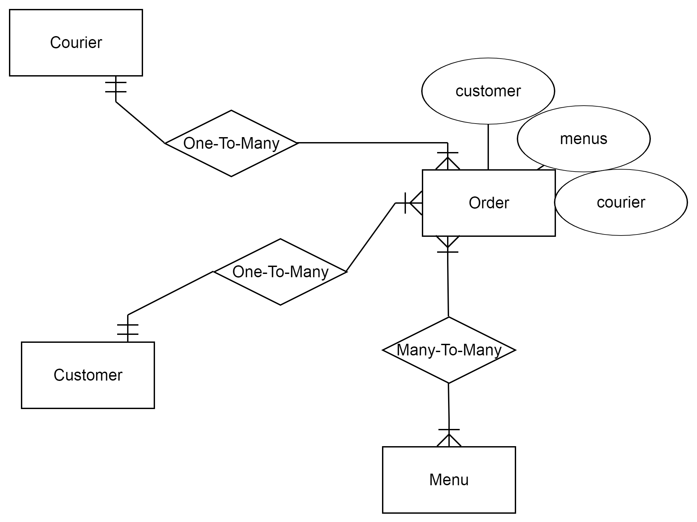
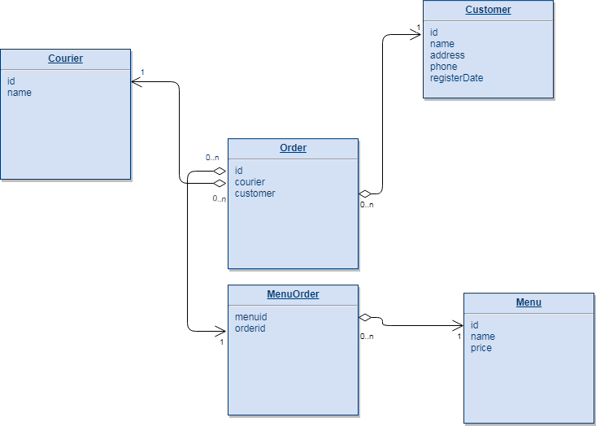
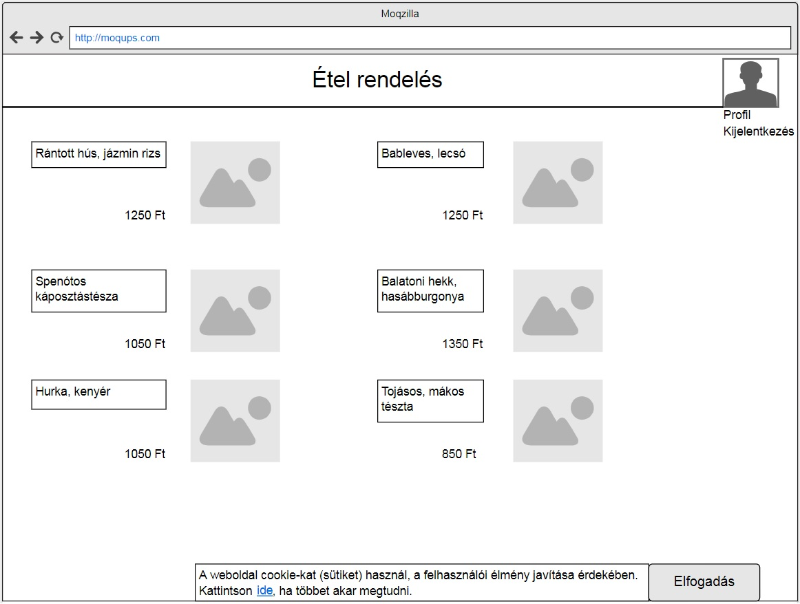
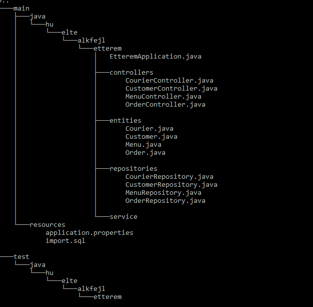

Alkalmazás fejlesztés beadandó
============

---

#### ÉTTEREM

A program egy étterem ételrendeléseit reprezentálja. 
Az étterem rendelkezik egy menüsorral, mely bárki számára megtekinthető.
A vendégek rendeléseket leadni csak bejelentkezve tudnak, melyhez regisztráció szükséges. 
A megrendelt ételek kiszállítását a futárok végzik.

### Táblák
* Rendelések
* Ételek
* Vendégek
* Futárok

#### Kapcsolatok
* Rendelések-Ételek: sok-sok kapcsolat
* Vendégek-Rendelések: egy-sok kapcsolat
* Futárok-Rendelések: egy-sok kapcsolat

#### Tábal kapcsolat diagram (egyszerűsített és teljes verzió)

### REST végpontok
* POST /api/register - Regisztrációs végpont az új felhasználók részére
* POST /api/login - Bejelentkező felület regisztrált felhasználók számára
* GET/POST /api/menus - Itt lehet listázni a menüket/hozzáadni újat
* GET/PATCH/DELETE /api/menu/{id} - Egy adott menü lekérdezése, módosítása, törlése
* GET/POST /api/orders - Itt lehet lekérdezni/leadni a rendeléseket (csak bejelentkezett felhasználóknak)
* GET/PATCH/DELETE /api/order/{id} - Egy adott rendelés lekérdezése, módosítása, törlése
* GET /api/couriers - A futárok adatait itt lehet lekérdezni
* GET/PATCH/DELETE /api/courier/{id} - Egy adott futár adatainak lekérdezése, módosítása, törlése
  
#### Funkcionális követelmények
* Regisztráció
* Bejelentkezés
* Étlap megtekintése
* Keresés
* Az étterem elérhetőségeinek megtekintése
* Bejelentkezett felhasználóknak
 	* Étel kosárba helyezése
 	* Étel törlése a kosárból
 	* Adatok módosítása
 	* Panasz írása/Értékelés
 	* A rendelést szállító futár adatainak megtekintése

#### Nem funkcionális követelmények
* Felhasználóbarát: Megfelelően elhatárolt funkciók. Világos, látható színekkel írt szövegek. Ésszerű elrendezés.
* Biztonság: Jelszóval védett funkciók. Titkosított jelszavak.
* Gyors és megbízható működés: Adatbázis használata
  
#### Szakterületi fogalomjegyzék
Az alkalmazás megértéséhez nem szükségesek szakszavak vagy nem mindennapi kifejezések

#### Szerepkörök
* Vendég: Az oldal nem regisztrált látogatója. Megtekintheti az étlapot, valamint az étterem elérhetőségeit. Tud a menüben keresni és regisztrálni.
* Bejelentkezett vendég: Regisztrált és bejelentkezett felhasználó, aki már rendeléseket is adhat le.
* Futár

#### Képernyőterv

### Fejlesztői környezet
* A program bármilyen operációs rendszeren futtatható. 
* A szoftver megfelel a MVC architeltúrának.
* A projektet Java Spring Boot technológia használatával kivitelezzük.

* **Használt eszközök, telepített szoftverek:**
	* Github a projekt közzétételéhez
	* Node.js Javascript környezet
	* NetBeans IDE 8.2
	* H2 adatbázis-kezelő rendszer	
	* Andular keretrendszer használata(6.1.9)
	* AJAX a szerverrel törénő kommunikációhoz	
* **Importált J2EE csomagok:**
	* JPA
	* lombok
	* Web services
	* DevTools
	* Web	
		
* **Fejlesztőkörnyezet felállítása:**
1. Git verziókezelő telepítése (Githubon történő regisztráció ajánlott)
2. Node.js környzet telepítése
3. Project klónozása (vagy letöltése) lokális gépre: git clone https://github.com/TucoBenedictoPacificoJuanMariaRamirez/alk_fejl.git
4. A projectkönyvtárban a függőségek telepítése

#### Könyvtárszerkezet

---

#### Fejlesztők
* ##### *Király Bianka*
* ##### *Nagy Bence*
